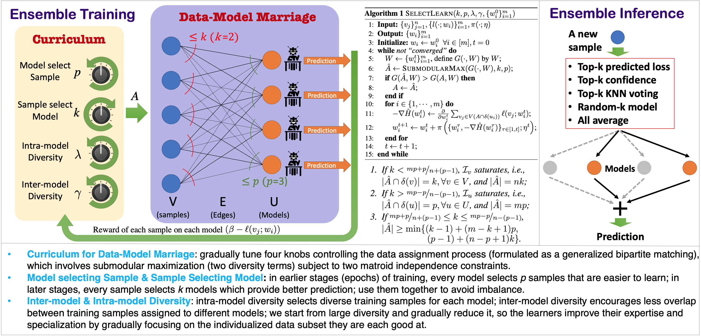
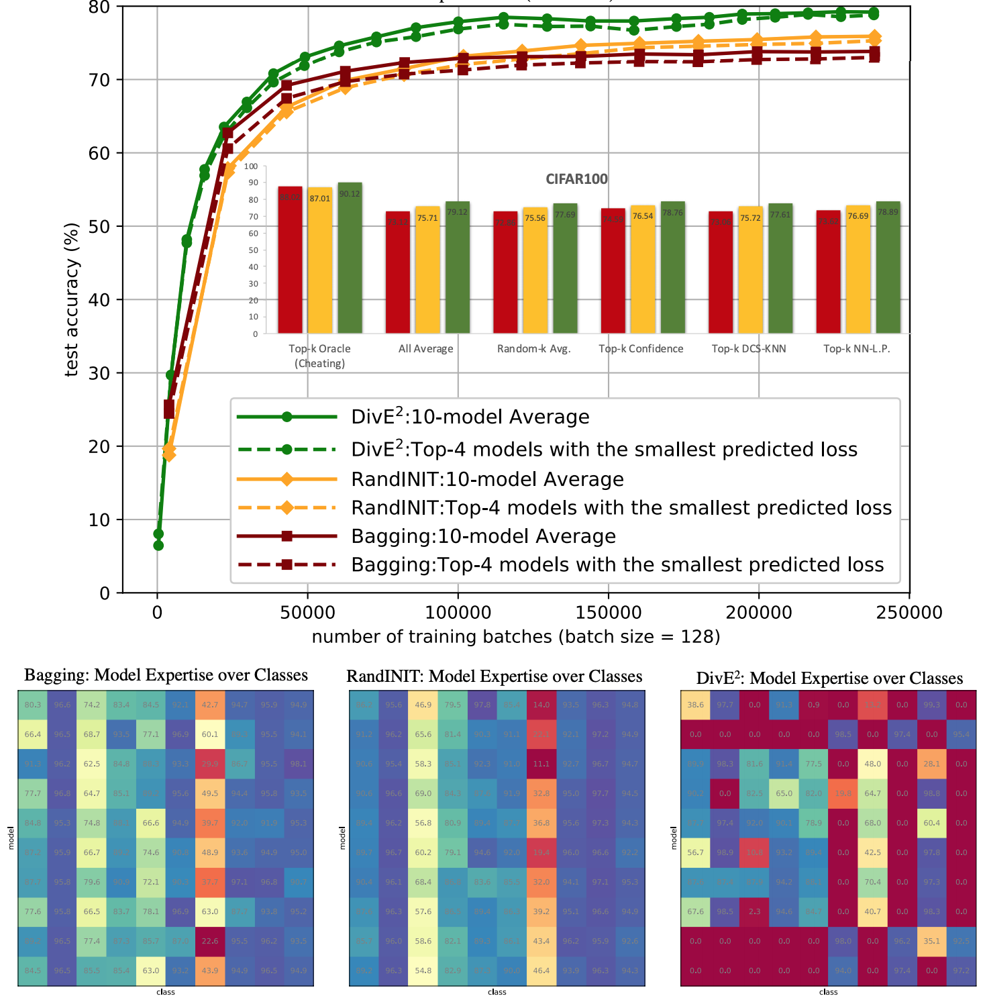

# Diverse Ensemble Evolution (DiVE2)

## NeurIPS 2018 paper:

<b>Title</b>: <i>Diverse Ensemble Evolution: Curriculum based Data-Model Marriage</i> <a href="https://papers.nips.cc/paper/7831-diverse-ensemble-evolution-curriculum-data-model-marriage.pdf">[pdf]</a> <a href="https://papers.nips.cc/paper/7831-diverse-ensemble-evolution-curriculum-data-model-marriage-supplemental.zip">[appendix]</a> <a href="Diverse_Ensemble_Evolution_NeurIPS18.pdf.pdf">[poster]</a>\
<b>Authors</b>: Tianyi Zhou, Shengjie Wang, Jeff A. Bilmes\
<b>Institute</b>: University of Washington, Seattle

<pre>
@inproceedings{
    zhou2018dive2,
    title={Diverse Ensemble Evolution: Curriculum based Data-Model Marriage},
    author={Tianyi Zhou and Shengjie Wang and Jeff A. Bilmes},
    booktitle={Advances in Neural Information Processing Systems 32 (NeurIPS)},
    year={2018},
}</pre>

<b>Abstract</b>\
We study a new method "Diverse Ensemble Evolution (DivE2)" to train an ensemble of machine learning models that assigns data to models at each training epoch based on each model's current expertise and an intra- and inter-model diversity reward. DivE2 schedules, over the course of training epochs, the relative importance of these characteristics; it starts by selecting easy samples for each model, and then gradually adjusts towards the models having specialized and complementary expertise on subsets of the training data, thereby encouraging high accuracy of the ensemble. We utilize an intra-model diversity term on data assigned to each model, and an inter-model diversity term on data assigned to pairs of models, to penalize both within-model and cross-model redundancy. We formulate the data-model marriage problem as a generalized bipartite matching, represented as submodular maximization subject to two matroid constraints. DivE2 solves a sequence of continuous-combinatorial optimizations with slowly varying objectives and constraints. The combinatorial part handles the data-model marriage while the continuous part updates model parameters based on the assignments. In experiments, DivE2 outperforms other ensemble training methods under a variety of model aggregation techniques, while also maintaining competitive efficiency.

